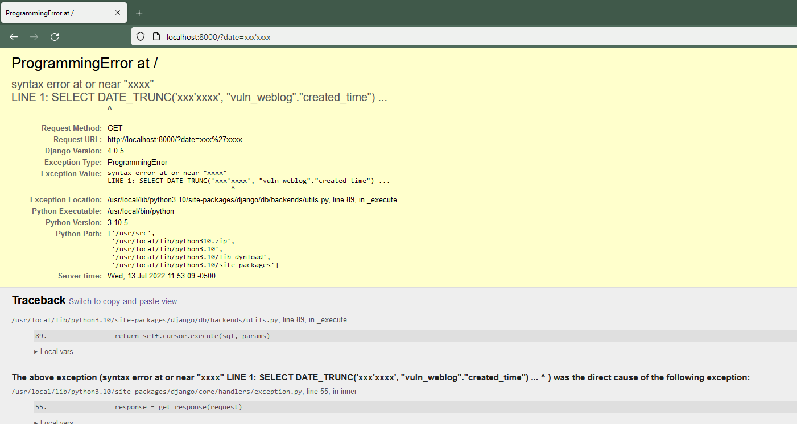

# Django Potential SQL injection via Trunc(kind) and Extract(lookup_name) arguments (CVE-2022-34265)

[中文版本(Chinese version)](README.zh-cn.md)

Django released a security update on July 4, 2022, which fixes a SQL injection vulnerability in the Trunc() and Extract() database functions.

Reference link:

- https://www.djangoproject.com/weblog/2022/jul/04/security-releases/

## Start Vulnerability Application

Start a vulnerable Django 4.0.5 by executing the following command:

```
docker compose up -d
```

After the server is started, you can see a web page at `http://your-ip:8000`.

This page use `Trunc` function to aggregate page click count by datetime. For example, use this link to see the number of clicks per minute: `http://your-ip:8000/?date=minute`:


## Vulnerability Reproduce

Change the `date` parameter to reproduce the SQL injection:

```
http://your-ip:8000/?date=xxxx'xxxx
```


